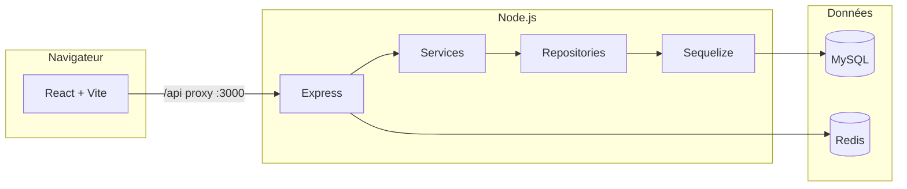

# Eventopia

Plateforme web de gestion et de découverte d’événements : interface React et API REST Node.js.  
Le dépôt regroupe un **backend Express** (API REST, JWT, MySQL), un **frontend Vite/React** et la **documentation** pédagogique.

---

## Sommaire

- [Identifiants de test](#identifiants-de-test)
- [Installation](#installation-détaillée)
- [Lancement](#lancement)
- [Architecture](#architecture)
- [Documentation](#documentation-complète)
- [Technologies](#technologies)

---

## Identifiants de test

| Rôle           | E-mail             | Mot de passe       |
|----------------|--------------------|--------------------|
| Administrateur | `admin@test.com`   | `MotDePasse123!`   |
| Utilisateur    | `user@test.com`    | `MotDePasse123!`   |

Si ces comptes n’existent pas encore en base, créez-les via **Inscription** sur le site ou adaptez un script d’amorçage (rôle `ADMIN` pour l’admin, `USER` pour l’utilisateur standard).

---

## Installation détaillée

### Prérequis

| Logiciel   | Rôle |
|------------|------|
| **Node.js** | LTS 18 ou 20 (npm inclus) |
| **MySQL**   | Base relationnelle (schéma géré par Sequelize au démarrage en développement) |
| **Redis**   | Sessions de refresh tokens, blacklist JWT, rate limiting côté auth |
| **Stripe**  | Optionnel (paiements) — clés dans `.env` si vous activez cette partie |

### 1. Dépendances npm

À la racine du projet (`mc/`, là où se trouve le `package.json` **eventopia**) :

```bash
npm install
npm install --prefix backend
npm install --prefix frontend
```

La racine installe uniquement **concurrently** pour lancer backend + frontend ensemble. Chaque application a son propre `node_modules`.

### 2. Base MySQL

1. Créez une base vide, par exemple :

   ```sql
   CREATE DATABASE eventopia_db CHARACTER SET utf8mb4 COLLATE utf8mb4_unicode_ci;
   ```

2. Créez un utilisateur MySQL avec les droits sur cette base (ou utilisez `root` en local).

### 3. Redis

Démarrez un serveur Redis sur `localhost:6379` (valeurs par défaut du projet), ou adaptez `REDIS_HOST` / `REDIS_PORT` / `REDIS_PASSWORD` dans `.env`.

### 4. Variables d’environnement (backend)

1. Copiez le modèle :

   ```bash
   copy backend\.env-example backend\.env
   ```

   sous Linux/macOS : `cp backend/.env-example backend/.env`

2. Éditez **`backend/.env`**. Variables minimales pour un premier lancement :

   | Variable | Exemple | Description |
   |----------|---------|-------------|
   | `NODE_ENV` | `development` | `development` active la synchronisation Sequelize (`alter`) au démarrage |
   | `PORT` | `4000` | Port d’écoute de l’API |
   | `FRONTEND_URL` | `http://localhost:3000` | Origine autorisée par CORS (séparateur `,` si plusieurs URLs) |
   | `DB_HOST` / `DB_PORT` | `localhost` / `3306` | Connexion MySQL |
   | `DB_USER` / `DB_PASSWORD` | `…` | Identifiants MySQL |
   | `DB_NAME` | `eventopia_db` | Nom de la base créée à l’étape 2 |
   | `JWT_ACCESS_SECRET` / `JWT_REFRESH_SECRET` | chaînes longues et aléatoires | Signature des JWT (obligatoire) |
   | `REDIS_HOST` / `REDIS_PORT` | `localhost` / `6379` | Redis |

Les secrets Stripe et les limites de débit (`RATE_LIMIT_*`) sont optionnels selon la configuration.

### 5. Premier démarrage et schéma

Au démarrage en développement, le serveur **teste la connexion MySQL**, **synchronise les modèles Sequelize** (`alter` en `development`) puis écoute sur `PORT`. Aucune commande `migrate` séparée n’est requise pour ce projet tel qu’il est configuré.

---

## Lancement

### Mode développement (recommandé)

Depuis la **racine** `mc/` :

```bash
npm run dev
```

Cette commande exécute en parallèle :

- `npm --prefix backend run dev` → `node --watch src/server.js` (rechargement du serveur à la modification des fichiers)
- `npm --prefix frontend run dev` → **Vite** sur le port **3000**

| Service    | URL |
|------------|-----|
| **Frontend** | [http://localhost:3000](http://localhost:3000) |
| **API**      | [http://localhost:4000/api](http://localhost:4000/api) (port par défaut `4000`, via `PORT` dans `.env`) |

Le frontend **vite** est configuré pour **proxy** les chemins `/api` et `/uploads` vers `http://localhost:4000` : le navigateur n’appelle que le port 3000 en développement.

**Vérification rapide de l’API :**

```text
GET http://localhost:4000/api/health
```

Réponse attendue : JSON avec `status` et `timestamp`.

### Lancer backend et frontend séparément

Deux terminaux :

```bash
cd backend && npm run dev
```

```bash
cd frontend && npm run dev
```

Utile pour isoler les logs ou déboguer un seul côté.

### Build de production (frontend)

```bash
npm run build --prefix frontend
```

Les fichiers statiques sont générés dans `frontend/dist/`. Prévoyez ensuite de servir ce dossier derrière un serveur web (ou `npm run preview --prefix frontend` pour un test local) et d’exposer l’API backend sur une URL configurée dans `FRONTEND_URL` / CORS.

---

## Architecture

### Vue d’ensemble



- **Frontend** : SPA React, routage React Router, contexte d’authentification, appels HTTP (Axios) vers `/api` (proxy Vite en dev).
- **Backend** : API REST sous le préfixe `/api`, authentification JWT (access + refresh), persistance MySQL via Sequelize, état volatile / sécurité via Redis.

### Backend (`backend/src/`)

Organisation en **couches** :

| Couche | Rôle | Exemples |
|--------|------|----------|
| **Routes** | Définition des endpoints HTTP, association contrôleurs / middlewares | `routes/*.routes.js`, `routes/index.js` |
| **Controllers** | Traduction HTTP ↔ appels services | `controllers/*Controller.js` |
| **Services** | Règles métier, orchestration | `services/*Service.js` |
| **Repositories** | Accès données, requêtes via modèles | `repositories/*Repository.js` |
| **Models** | Entités Sequelize (User, Event, Inscription, etc.) | `models/` |
| **Middlewares** | Auth JWT, rôles, validation Joi, rate limit, erreurs | `middlewares/` |
| **Config** | DB, Redis, logs | `config/` |

Préfixe API : tout est monté sous **`/api`** (voir `server.js`).

Routes principales exposées par `routes/index.js` :

| Préfixe | Domaine |
|---------|---------|
| `/api/health` | Santé du serveur |
| `/api/auth` | Inscription, connexion, refresh, déconnexion |
| `/api/events` | Événements |
| `/api/users` | Utilisateurs |
| `/api/inscriptions` | Inscriptions aux événements |

### Frontend (`frontend/src/`)

| Zone | Rôle |
|------|------|
| **`pages/`** | Écrans (accueil, login, liste/détail d’événements, tableaux de bord, profil, création d’événement…) |
| **`components/`** | Layout, header, footer, routes protégées, pagination, etc. |
| **`context/AuthContext.jsx`** | Session utilisateur et tokens côté client |
| **`services/`** | Client API (`api.js`, `events.js`, `users.js`) |

Les routes **protégées** (`ProtectedRoute`) restreignent l’accès selon le rôle (`USER`, `ORGANIZER`, `ADMIN`).

### Flux de données (exemple)

1. L’utilisateur se connecte sur `/login` → `POST /api/auth/login` → tokens stockés côté client.
2. La liste des événements charge via le service `events` → `GET /api/events/...` (selon vos routes).
3. Les fichiers uploadés et l’API passent par le proxy Vite en dev ; en production, il faut aligner l’URL de l’API et la configuration CORS / `FRONTEND_URL`.

---

## Documentation complète

Voir le dossier **[docs/](docs/)** — index : [docs/README.md](docs/README.md) (liens vers les TPs et le guide mobile).

---

## Technologies

| Couche | Stack |
|--------|--------|
| **Backend** | Node.js, Express 5, Sequelize (MySQL), Redis (ioredis), JWT, bcrypt, Joi, Stripe (optionnel), Winston, Helmet, rate limiting |
| **Frontend** | React 19, Vite 6, React Router 7, TanStack Query, Axios, Tailwind CSS 4, Headless UI, Heroicons |
| **Outils** | `concurrently` (démarrage parallèle), `node --watch` (backend), ESLint (frontend) |
